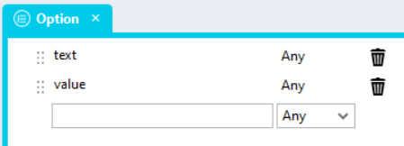
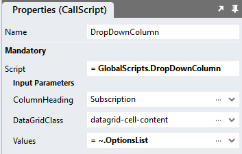
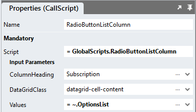
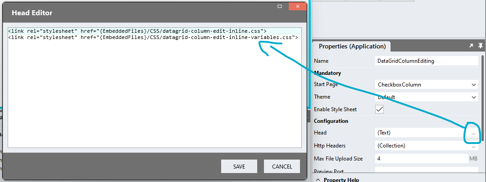

# DataGrid Inline Column Editing

This module shows how to enable editing of data contained in a specific DataGrid column. Data updates need to be processed immediately in the change event script handler. 

https://github.com/stadium-software/datagrid-column-edit-inline/assets/2085324/822e6933-472b-487d-801a-24a798be62dd

## Sample applications
This repo contains one Stadium 6.7 application
[DataGridInlineColumnEditing.sapz](Stadium6/DataGridInlineColumnEditing.sapz?raw=true)

# Contents
- [DataGrid Inline Column Editing](#datagrid-inline-column-editing)
  - [Sample applications](#sample-applications)
- [Contents](#contents)
- [Version](#version)
- [CheckBox Column Editing](#checkbox-column-editing)
  - [CheckBox Column Global Script Setup](#checkbox-column-global-script-setup)
  - [Checkbox Page-Script Setup](#checkbox-page-script-setup)
  - [Checkbox Page Setup](#checkbox-page-setup)
  - [Checkbox Page.Load Event Setup](#checkbox-pageload-event-setup)
- [DropDown Column Editing](#dropdown-column-editing)
  - [DropDown Column Global Script Setup](#dropdown-column-global-script-setup)
  - [Type Setup](#type-setup)
  - [DropDown Page-Script Setup](#dropdown-page-script-setup)
  - [DropDown Page Setup](#dropdown-page-setup)
  - [DropDown Page.Load Event Setup](#dropdown-pageload-event-setup)
- [RadioButtonList Column Editing](#radiobuttonlist-column-editing)
  - [RadioButtonList Column Global Script Setup](#radiobuttonlist-column-global-script-setup)
  - [Type Setup](#type-setup-1)
  - [RadioButtonList Page-Script Setup](#radiobuttonlist-page-script-setup)
  - [RadioButtonList Page Setup](#radiobuttonlist-page-setup)
  - [RadioButtonList Page.Load Event Setup](#radiobuttonlist-pageload-event-setup)
- [Styling](#styling)
  - [Applying the CSS](#applying-the-css)
  - [Customising CSS](#customising-css)
  - [CSS Upgrading](#css-upgrading)

# Version 
1.1 Added logic to detect DataGrid class uniqueness
1.2 Amended scripts to work with changed DG HTML rendering
1.3 Added custom event handler feature

# CheckBox Column Editing
For this module to work, the DataGrid must contain an column showing a boolean value

## CheckBox Column Global Script Setup
1. Create a Global Script called "CheckboxColumn"
2. Add the input parameters below to the Global Script
   1. ColumnHeading
   2. DataGridClass
   3. CallbackScript
3. Drag a *JavaScript* action into the script
4. Add the Javascript below into the JavaScript code property (ignore the validation error message "Invalid script was detected")
```javascript
/* Stadium Script Version 1.3 */
let scope = this;
let callback = ~.Parameters.Input.CallbackScript;
let dgClassName = "." + ~.Parameters.Input.DataGridClass;
let dg = document.querySelectorAll(dgClassName);
if (dg.length == 0) {
    dg = document.querySelector(".data-grid-container");
} else if (dg.length > 1) {
    console.error("The class '" + dgClassName + "' is assigned to multiple DataGrids. DataGrids using this script must have unique classnames");
    return false;
} else { 
    dg = dg[0];
}
dg.classList.add("datagrid-inline-column-editing");
let table = dg.querySelector("table");
let colHeading = ~.Parameters.Input.ColumnHeading;
let column = getColumnNumber(colHeading);
let options = {
        characterData: true,
        childList: true,
        subtree: true,
    },
    observer = new MutationObserver(setCellContent);
observer.observe(table, options);

function setCellContent() {
    observer.disconnect();
    let cells = table.querySelectorAll("tr td:nth-child(" + column + ")");
    for (let i = 0; i < cells.length; i++) {
        let input = cells[i].querySelector("input");
        let celldiv = cells[i].querySelector("div");
        if (!celldiv) {
            celldiv = document.createElement("div");
            let cellContent = cells[i].innerHTML;
            cells[i].innerHTML = "";
            celldiv.innerHTML = cellContent;
            cells[i].appendChild(celldiv);
        }
        celldiv.classList.add("visually-hidden");
        if (!input) {
            input = document.createElement("input");
            input.setAttribute("type", "checkbox");
            cells[i].appendChild(input);
            input.addEventListener("change", async e => {
                observer.disconnect();
                if (e.target.checked) {
                    celldiv.textContent = "Yes";
                } else { 
                    celldiv.textContent = "No";
                }
                observer.observe(table, options);
                let row = e.target.closest("tr");
                let data = rowToObj(table, row);
                await scope[callback](data);
            });
        }
        if (cells[i].textContent == "Yes") {
            input.setAttribute("checked", "");
        } else { 
            input.removeAttribute("checked");
        }
    }
    observer.observe(table, options);
}
function getColumnNumber(title) {
    let arrHeadings = table.querySelectorAll("thead th a");
    let colNo = 0;
    for (let i = 0; i < arrHeadings.length; i++) {
        if (arrHeadings[i].innerText.toLowerCase() == title.toLowerCase()) {
            colNo = i + 1;
        }
    }
    return colNo;
}
function rowToObj(table, row) {
    let propCells = table.rows[0].cells;
    let propNames = [];
    let obj, cells;
    for (let i = 0; i<propCells.length; i++) {
        propNames.push(propCells[i].textContent || propCells[i].innerText);
    }
    cells = row.cells;
    obj = {};
    for (let k = 0; k < propCells.length; k++) {
        let cellText = cells[k].textContent || cells[k].innerText;
        obj[propNames[k]] = cellText;
    }
    return obj;
}
```

## Checkbox Page-Script Setup
1. Create a Script inside of the Page with any name you like (e.g. "ChangeEventHandler")
2. Add one input parameter to the Script
   1. RowData
3. Drag a *Notification* action into the script
4. In the *Message* property, select the *RowData* parameter from the *Script Input Parameters* category

## Checkbox Page Setup
1. Drag a *DataGrid* control to the page ([see above](#database-connector-and-datagrid))
2. Add a class of your choosing to the *DataGrid* *Classes* property to uniquely identify this DataGrid (e.g datagrid-column-edit-inline)
3. Note: Each DataGrid on a page must have a unique class assigned to it

## Checkbox Page.Load Event Setup
1. Drag the Global Script called "CheckboxColumn" into the Page.Load script
2. Complete the input properties
   1. ColumnHeading: The heading of the column you wish to enable editing for
   2. DataGridClass: The class you assigned to the DataGrid (e.g datagrid-column-edit-inline)
   3. CallbackScript: The name of the page-level script that will process the updated data (e.g. "ChangeEventHandler")
3. Populate the DataGrid with data ([see above](#database-connector-and-datagrid))

# DropDown Column Editing
For this module to work, the DataGrid must contain an enum column

## DropDown Column Global Script Setup
1. Create a Global Script called "DropDownColumn"
2. Add the input parameters below to the Global Script
   1. ColumnHeading
   2. DataGridClass
   3. Values
   4. CallbackScript
3. Drag a *JavaScript* action into the script
4. Add the Javascript below into the JavaScript code property (ignore the validation error message "Invalid script was detected")
```javascript
/* Stadium Script Version 1.3 */
let scope = this;
let callback = ~.Parameters.Input.CallbackScript;
let dgClassName = "." + ~.Parameters.Input.DataGridClass;
let dg = document.querySelectorAll(dgClassName);
if (dg.length == 0) {
    dg = document.querySelector(".data-grid-container");
} else if (dg.length > 1) {
    console.error("The class '" + dgClassName + "' is assigned to multiple DataGrids. DataGrids using this script must have unique classnames");
    return false;
} else { 
    dg = dg[0];
}
dg.classList.add("datagrid-inline-column-editing");
let table = dg.querySelector("table");
let colHeading = ~.Parameters.Input.ColumnHeading;
let column = getColumnNumber(colHeading);
let vals = ~.Parameters.Input.Values;
let options = {
        characterData: true,
        childList: true,
        subtree: true,
    },
    observer = new MutationObserver(setCellContent);
observer.observe(table, options);

function setCellContent() {
    observer.disconnect();
    let cells = table.querySelectorAll("tbody tr td:nth-child(" + column + ")");
    for (let i = 0; i < cells.length; i++) {
        let cell = cells[i];
        let celldiv = cells[i].querySelector("div");
        if (!celldiv) {
            celldiv = document.createElement("div");
            let cellContent = cells[i].innerHTML;
            cells[i].innerHTML = "";
            celldiv.innerHTML = cellContent;
            cells[i].appendChild(celldiv);
        }
        let cellText = celldiv.innerText;
        let select = cell.querySelector("select");
        if (!select) {
            select = document.createElement("select");
            select.classList.add("form-control");
            select.classList.add("datagrid-dropdown");
            cell.appendChild(select);
            for (let j = 0; j < vals.length; j++) { 
                var option = document.createElement("option");
                option.text = vals[j].text;
                option.value = vals[j].value;
                select.add(option);
            }
            select.addEventListener("change", async e => {
                observer.disconnect();
                celldiv.innerText = e.target.value;
                observer.observe(table, options);
                let row = e.target.closest("tr");
                let data = rowToObj(table, row);
                await scope[callback](data);
            });
        }
        select.value = cellText;
        celldiv.classList.add("visually-hidden");
    }
    observer.observe(table, options);
}
function getColumnNumber(title) {
    let arrHeadings = table.querySelectorAll("thead th a");
    let colNo = 0;
    for (let i = 0; i < arrHeadings.length; i++) {
        if (arrHeadings[i].innerText.toLowerCase() == title.toLowerCase()) {
            colNo = i + 1;
        }
    }
    return colNo;
}
function rowToObj(table, row) {
    let propCells = table.rows[0].cells;
    let propNames = [];
    let obj, cells;
    for (let i = 0; i<propCells.length; i++) {
        propNames.push(propCells[i].textContent || propCells[i].innerText);
    }
    cells = row.cells;
    obj = {};
    for (let k = 0; k < propCells.length; k++) {
        let cellText = cells[k].textContent || cells[k].innerText;
        if (cells[k].querySelector("select")) cellText = cells[k].querySelector("div").innerText;
        obj[propNames[k]] = cellText;
    }
    return obj;
}
```

## Type Setup
1. Create a type and call it "Option"
2. Assign two properties to the type
   1. text (any)
   2. value (any)



## DropDown Page-Script Setup
1. Create a Script inside of the Page with any name you like (e.g. "ChangeEventHandler")
2. Add one input parameter to the Script
   1. RowData
3. Drag a *Notification* action into the script
4. In the *Message* property, select the *RowData* parameter from the *Script Input Parameters* category

## DropDown Page Setup
1. Drag a *DataGrid* control to the page ([see above](#database-connector-and-datagrid))
2. Add a class of your choosing to the *DataGrid* *Classes* property to uniquely identify this DataGrid (e.g datagrid-column-edit-inline)
3. Note: Each DataGrid on a page must have a unique class assigned to it

## DropDown Page.Load Event Setup
1. Drag a *List* action into the script
2. Select the "Option" type from the dropdown in the *Item Type* property
3. Populate the list with values (manually or from a datasource)
4. Drag the Global Script called "DropDownColumn" into the Page.Load script
5. Complete the input properties
   1. ColumnHeading: The heading of the column you wish to enable editing for
   2. DataGridClass: The class you assigned to the DataGrid (e.g datagrid-column-edit-inline)
   3. Values: Select the *List* of values from the property dropdown
   4. CallbackScript: The name of the page-level script that will process the updated data (e.g. "ChangeEventHandler")
6. Populate the DataGrid with data ([see above](#database-connector-and-datagrid))



# RadioButtonList Column Editing
For this module to work, the DataGrid must contain an enum column

## RadioButtonList Column Global Script Setup
1. Create a Global Script called "RadioButtonListColumn"
2. Add the input parameters below to the Global Script
   1. ColumnHeading
   2. DataGridClass
   3. Values
   4. CallbackScript
3. Drag a *JavaScript* action into the script
4. Add the Javascript below into the JavaScript code property (ignore the validation error message "Invalid script was detected")
```javascript
/* Stadium Script Version 1.3 */
let scope = this;
let callback = ~.Parameters.Input.CallbackScript;
let dgClassName = "." + ~.Parameters.Input.DataGridClass;
let dg = document.querySelectorAll(dgClassName);
if (dg.length == 0) {
    dg = document.querySelector(".data-grid-container");
} else if (dg.length > 1) {
    console.error("The class '" + dgClassName + "' is assigned to multiple DataGrids. DataGrids using this script must have unique classnames");
    return false;
} else { 
    dg = dg[0];
}
dg.classList.add("datagrid-inline-column-editing");
let table = dg.querySelector("table");
let colHeading = ~.Parameters.Input.ColumnHeading;
let column = getColumnNumber(colHeading);
let vals = ~.Parameters.Input.Values;
let options = {
        characterData: true,
        childList: true,
        subtree: true,
    },
    observer = new MutationObserver(setCellContent);
observer.observe(table, options);

function setCellContent() {
    observer.disconnect();
    removeRadioButtons();
    let cells = table.querySelectorAll("tbody tr td:nth-child(" + column + ")");
    for (let i = 0; i < cells.length; i++) {
        let cell = cells[i];
        let celldiv = cells[i].querySelector("div");
        if (!celldiv) {
            celldiv = document.createElement("div");
            let cellContent = cells[i].innerHTML;
            cells[i].innerHTML = "";
            celldiv.innerHTML = cellContent;
            cells[i].appendChild(celldiv);
        }
        let cellText = celldiv.innerText;
        let radioContainer = cell.querySelector(".radio-button-list-container");
        radioContainer = document.createElement("div");
        radioContainer.classList.add("radio-button-list-container", "inline-radio-button-list-container");
        for (let j = 0; j < vals.length; j++) {
            let radioWrapper = document.createElement("div");
            radioWrapper.classList.add("radio");
            let radio = document.createElement("input");
            radio.type = "radio";
            let name = dgClassName + "_" + "radio_inline_" + i;
            radio.name = name;
            let id = name + "_radio_" + j;
            radio.id = id;
            radio.value = vals[j].value;
            if (vals[j].value == cellText) {
                radio.checked = "true";
            }
            radio.addEventListener("change", async e => {
                observer.disconnect();
                celldiv.textContent = e.target.value;
                observer.observe(table, options);
                let row = e.target.closest("tr");
                let data = rowToObj(table, row);
                await scope[callback](data);
            });
            let label = document.createElement("label");
            label.setAttribute("for", id);
            label.innerText = vals[j].text;
            radioWrapper.appendChild(radio);
            radioWrapper.appendChild(label);
            radioContainer.appendChild(radioWrapper);
        }
        cell.appendChild(radioContainer);
        celldiv.classList.add("visually-hidden");
    }
    observer.observe(table, options);
}
function getColumnNumber(title) {
    let arrHeadings = table.querySelectorAll("thead th a");
    let colNo = 0;
    for (let i = 0; i < arrHeadings.length; i++) {
        if (arrHeadings[i].innerText.toLowerCase() == title.toLowerCase()) {
            colNo = i + 1;
        }
    }
    return colNo;
}
function rowToObj(table, row) {
    let propCells = table.rows[0].cells;
    let propNames = [];
    let obj, cells;
    for (let i = 0; i<propCells.length; i++) {
        propNames.push(propCells[i].textContent || propCells[i].innerText);
    }
    cells = row.cells;
    obj = {};
    for (let k = 0; k < propCells.length; k++) {
        let cellText = cells[k].textContent || cells[k].innerText;
        if (cells[k].querySelector(".radio")) cellText = cells[k].querySelector("div").innerText;
        obj[propNames[k]] = cellText;
    }
    return obj;
}
function removeRadioButtons() {
    let radios = table.querySelectorAll('.inline-radio-button-list-container');
    for (let j = 0; j < radios.length; j++) {
        radios[j].remove();
    }
}
```

## Type Setup
1. Create a type and call it "Option"
2. Assign two properties to the type
   1. text (any)
   2. value (any)


## RadioButtonList Page-Script Setup
1. Create a Script inside of the Page with any name you like (e.g. "ChangeEventHandler")
2. Add one input parameter to the Script
   1. RowData
3. Drag a *Notification* action into the script
4. In the *Message* property, select the *RowData* parameter from the *Script Input Parameters* category

## RadioButtonList Page Setup
1. Drag a *DataGrid* control to the page ([see above](#database-connector-and-datagrid))
2. Add a class of your choosing to the *DataGrid* *Classes* property to uniquely identify this DataGrid (e.g datagrid-column-edit-inline)
3. Note: Each DataGrid on a page must have a unique class assigned to it

## RadioButtonList Page.Load Event Setup
1. Drag a *List* action into the script
2. Select the "Option" type from the dropdown in the *Item Type* property
3. Populate the list with values (manually or from a datasource)
4. Drag the Global Script called "RadioButtonListColumn" into the Page.Load script
5. Complete the input properties
   1. ColumnHeading: The heading of the column you wish to enable editing for
   2. DataGridClass: The class you assigned to the DataGrid (e.g datagrid-column-edit-inline)
   3. Values: Select the *List* of values from the property dropdown
   4. CallbackScript: The name of the page-level script that will process the updated data (e.g. "ChangeEventHandler")
6. Populate the DataGrid with data ([see above](#database-connector-and-datagrid))



# Styling
Various elements in this module can be styled using the two CSS files in this repo

## Applying the CSS

**Stadium 6.6 or higher**
1. Create a folder called "CSS" inside of your Embedded Files in your application
2. Drag the two CSS files from this repo [*datagrid-column-edit-inline-variables.css*](datagrid-column-edit-inline-variables.css) and [*datagrid-column-edit-inline.css*](datagrid-column-edit-inline.css) into that folder
3. Paste the link tags below into the *head* property of your application
```html
<link rel="stylesheet" href="{EmbeddedFiles}/CSS/datagrid-column-edit-inline.css">
<link rel="stylesheet" href="{EmbeddedFiles}/CSS/datagrid-column-edit-inline-variables.css">
``` 



**Versions lower than 6.6**
1. Copy the CSS from the two css files into the Stylesheet in your application

## Customising CSS
1. Open the CSS file called [*datagrid-column-edit-inline-variables.css*](datagrid-column-edit-inline-variables.css) from this repo
2. Adjust the variables in the *:root* element as you see fit
3. Overwrite the file in the CSS folder of your application with the customised file

## CSS Upgrading
To upgrade the CSS in this module, follow the [steps outlined in this repo](https://github.com/stadium-software/samples-upgrading)
